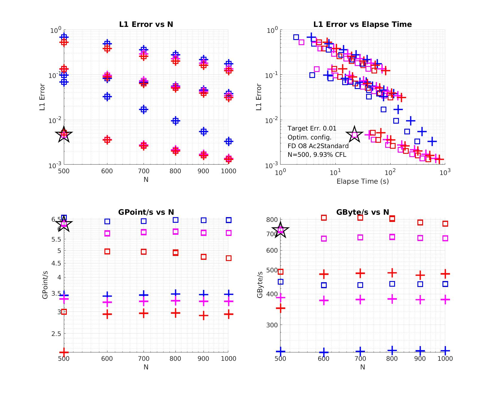

**TABLE OF CONTENTS**

- [Welcome to hpcscan](#welcome-to-hpcscan)
- [Overview](#overview)
  * [Description](#description)
  * [Why another benchmark?](#why-another-benchmark)
  * [What hpcscan is](#what-hpcscan-is)
  * [What hpcscan is not](#what-hpcscan-is-not)
  * [Quick start](#quick-start)
  * [Versions](#versions)
- [Main features](#main-features)
  * [Project directories](#project-directories)
  * [List of test cases](#list-of-test-cases)
  * [List of test modes](#list-of-test-modes)
- [Environment set-up](#environment-set-up)
  * [Basic requirements](#basic-requirements)
  * [Optional requirements](#optional-requirements)
  * [Environment script (mandatory)](#environment-script-mandatory)
- [Compilation](#compilation)
  * [Makefile](#makefile)
  * [Enabled test modes](#enabled-test-modes)
- [Validation](#validation)
  * [Validation tests](#validation-tests)
  * [Validated hardware, operating systems and compilers](#validated-hardware-operating-systems-and-compilers)
- [Execution](#execution)
  * [Usage](#usage)
  * [Input and output](#input-and-output)
- [Performance benchmarks](#performance-benchmarks)
- [Customization](#customization)
- [Have fun!](#have-fun)
  * [Share feedback](#share-feedback)
  * [Contributing to hpcscan](#contributing-to-hpcscan)

# Welcome to hpcscan

Version 1.1

Contact: Vincent Etienne / Email: vetienne@rocketmail.com

Contributors (chronological order)
* Vincent Etienne (Saudi Aramco)
* Suha Kayum (Saudi Aramco)
* Marcin Rogowski (KAUST)
* Laurent Gatineau (NEC)
* Philippe Thierry (Intel)
* Fabrice Dupros (ARM)

# Overview

## Description

hpcscan is a tool for **benchmarking algorithms/kernels** that are found in many scientific applications on **various architectures/systems**.

It features several categories of test cases aiming to measure memory, computation and communication bandwidths.

* Entirely written in C++
* Simple code struture based on individual test cases
* Easy to add new test cases
* Design centered on a unique class that handles all operations on multi-dimension (1, 2 \& 3D) Cartesian grids
* Hybrid OpenMP/MPI parallelism
* Support for CUDA (NVIDIA GPUs), HIP (AMD GPUs)  and other specific features are available depending on compiler/architecture
* All configuration parameters on command line
* Support single and double precision computation
* Compilation with standard Makefile
* No external librairies
* Follows [C++ Google style code](https://google.github.io/styleguide/cppguide.html)
* All test cases are validated with embedded reference solutions

## Why another benchmark?

There exist several benchmarks commonly used in the HPC community. Just to cite a few, the [Stream benchmark](https://www.cs.virginia.edu/stream/) and the [OSU Micro benchmarks](https://mvapich.cse.ohio-state.edu/benchmarks/), allow to measure the memory bandwidth and the interconnect bandwidth respectively.
In general, these benchmarks target specific characteristics of HPC systems.
However, it is **not straightforward to transpose these characteristics in the context of a given scientific application.**

This is why, HPC vendors used to present throughputs obtained with open source scientific codes such as for instance [OpenFOAM](https://www.openfoam.com/) (Computational Fluid Dynamics) or [SPECFEM3D](https://geodynamics.org/cig/software/specfem3d/) (Seismology).
While these results are important to assess the performance of a given architecture to solve concrete problems, it is again not straightforward to transpose conclusions to other applications. Moreover, every application has been built on technical choices that may hinder performance on a system compared to another. **How to overcome these technical biases?**

hpcscan has been designed to address these issues :smiley:

## What hpcscan is

:ballot_box_with_check: **Lightweight and portable** tool that can be easily deployed on a wide range of architectures including CPUs, GPUs and accelerators (see [Validated hardware, operating systems and compilers](#validated-hardware-operating-systems-and-compilers)). 

:ballot_box_with_check: **Bridge** between HPC architectures and numerical analysis/computational sciences. Beyond getting accurate performance measurements, hpcscan allows to explore the behavior of numerical kernels and to seek for the optimal configuration on a given architecture. An example is shown below where several key parameters of an algorithm (a wave propagation kernel) are explored to find the optimum (in terms of computation speed vs accuracy) on the supercomputer Shaheen II at KAUST. See  [Performance benchmarks](#performance-benchmarks) for details on this test case as well as scripts to perform the analysis.



<font size="2"> **Top left:** L1 Error between the computed (wavefield) and analytical solutions versus N, the number of grid points along on direction (grid size is NxNxN). Blue: Finite-Difference with 4th order stencil, Pink: 8th order and Red: 12th order. Squares are obtained with the standard propagator implementation while crosses are obtained when the Laplacian operator is computed separately. </font>

<font size="2"> **Top right:** L1 Error between the computed and analytical solutions versus the computation time. The black star points to the configuration with an error below 1% and shortest computation time (i.e. the optimal configuration relative to the target error). </font>

<font size="2"> **Bottom left:** Propagator bandwidth in GPoint/s versus N. </font>

<font size="2"> **Bottom right:** Propagator bandwidth in GBtye/s versus N. </font>

:ballot_box_with_check: **Set of representative kernels** used in many scientific applications (see [List of test cases](#list-of-test-cases)). Without being too specific, the embedded kernels provide a way to capture the main traits of HPC architectures and identify their bottle-necks and strenghts. With this knowledge, one can re-design or update accordingly specific parts of an application to take full benefit of the target hardware.

:ballot_box_with_check: **Set of robust protocols** to compare architectures. As suggested in the example above, the optimal configuration to solve a given problem might change from an architecture to another. hpcscan provides a solid framework to compare performances between different systems, where one can analyse results from different perspectives and achieve 'apples to apples' comparisons.  

:ballot_box_with_check: **Customizable** to fit a specific hardware (see [Customization](#customization)).

:ballot_box_with_check: **Multi-purpose** initiative with benefits at several levels: from computer science students eager to learn to seasoned numerical analysts willing to share their findings or to software engineers reusing kernels of interest to upgrade their applications. 

:ballot_box_with_check: **On-going** effort at the first phase aiming to collect contributions to cover the current offer of HPC systems. More options and kernels will be added in a second phase.

## What hpcscan is not

:no_entry: **One-number** benchmark to rank HPC systems. However, hpcscan provides a way to perform a complete 'scanning' of architectures and possibly focus on one characteristic.

:no_entry: **Confidential** project. Everyone is invited to share results, feedbacks and more important contributions for the benefit of the entire HPC community.

## Quick start

hpcscan is a self-content package that can be easily installed and executed on your system. Just follow the steps:
* Step 1: [create the environment script for your system](#environment-script-mandatory)
* Step 2: [build the executable](#makefile)
* Step 3: [validate the executable](#validation-tests)
* Step 4: [run the performance benchmarks](#performance-benchmarks)

## Versions

Version      | Description | Release date
------------ | ----------- | ------------
v1.0         | Initial version with test modes Baseline, CacheBlk and NEC_SCA  | Nov 28, 2020
v1.1         | Added test modes NEC, CUDA and HIP | May 22, 2021

# Main features

## Project directories

* `bin` this directory is created during compilation and contains hpcscan executable
* `build` hpcscan can be compiled from here
* `env` scripts to initialize hpcscan environment
* `mics` output samples and studies 
* `script` scripts for validation and performance benchmarks
* `src` all hpcscan source files

## List of test cases

Test case name | Description | Remark
------------ | ----------- | ------------
Comm         | **MPI communications bandwidth** <ul><li>Uni-directional (Half-duplex with MPI_Send) proc1 -> proc2</li><li>Bi-directional (Full-duplex with MPI_Sendrecv) proc1 <-> proc2</li><li>Grid halos exchange (MPI_Sendrecv) all procs <-> all procs</li></ul> | <p>This case requires at least 2 MPI processes <br> Depending on the placement of MPI processes, intra-node or inter-node bandwidth can be measured <br> Width of halos depends on the selected FD stencil order <br> :arrow_right: **Validation against reference grids filled with predefined values** <br> :arrow_right: **Measures GPoints/s and GBytes/s** </p>
FD_D2        | **Finite-difference (second derivatives in space) computations bandwidth** <ul><li>  (for grid dim. 1, 2 or 3) </li> <li>  (for grid dim. 2 or 3) </li>  <li>  (for grid dim. 3) </li> <li>  (for grid dim 2 or 3) </li> </ul> | <p>Accuracy is checked against multi-dimensional sine function <br> Accuracy depends on the selected FD stencil order, the spatial grid sampling and the number of periods in the sine function <br> :arrow_right: **Computes L1 Error against analytical solution** <br> :arrow_right: **Measures GPoints/s, GBytes/s and GFlop/s** </p> 
Grid         | **Grid operations bandwidth** <ul> <li> Fill grid U with constant value </li> <li> Max. diff. between grids U and V </li> <li> L1 norm between U and V </li> <li> Sum of abs(U) </li> <li> Sum of abs(U-V) </li> <li> Max. of U </li> <li> Min. of U </li> <li> Complex grid manipulation (wavefield update in propagator) U = 2 x V - U + C x L </li> <li> Boundary condition (free surface) at all edges of U </li> </ul> | <p>Operations on grids include manipulation of multi-dimensional indexes and specific portions of the grids (for instance, excluding halos) <br> :arrow_right: **Validation against reference grids filled with predefined values** <br> :arrow_right: **Measures GPoints/s and GBytes/s** <p>
Memory       | **Memory operations bandwidth** <ul> <li> Fill array A with constant value </li> <li> Copy array A = B </li> <li> Add 2 arrays A = B + C </li> <li> Multiply 2 arrays A = B * C </li> <li> Add 2 arrays and update array A = A + B </li> </ul>| <p> Conversely to Test Case Grid, operations are done on continuous memory arrays <br> This test case is similar to the Stream benchmark <br> :arrow_right: **Validation against reference grids filled with predefined values** <br> :arrow_right: **Measures GPoints/s and GBytes/s** <p>
Propa        | **Acoustic wave propagator bandwidth** <ul> <li> 2nd order wave equation </li> <li>  </li> <li> Domain size is 1 m in every dimension </li> <li> c is constant and equals to 1 m/s </li> <li> Free surface boundary condition is applied to all edges of the domain </li> <li> Wavefield is initialized at t=-dt and t=-2dt with a particular solution </li> </ul> | <p>Accuracy is checked against the multi-dimensional analytical solution (Eigen modes) of the wave equation<br>Number of modes can be parametrized differently in every dimension<br>Time step can be set arbitrarily or set to the stability condition<br>Dimension, grid size, and number of time steps can be set arbitrarily<br>Accuracy depends on the selected FD stencil order, the spatial grid sampling and the number of Eigen modes <br> :arrow_right: **Computes L1 Error against analytical solution** <br> :arrow_right: **Measures GPoints/s, GBytes/s and GFlop/s** </p> 
Template     | Test case template | Used to create new test cases
Util         | Utility tests to check internal functions | Reserved for developpers

## List of test modes

Test mode name | Description | Remark
------------ | ----------- | ------------
Baseline     | CPU standard implementation | :arrow_right: **This mode is the reference implementation without any optimization.** <br> Always enabled
CacheBlk     | CPU with cache blocking optimization techniques | Always enabled
CUDA         | GPU with CUDA without optimization | Only enabled when compiled with nvcc (NVIDIA CUDA compiler)
HIP          | GPU with HIP without optimization | Only enabled when compiled with hipcc (AMD HIP compiler)
NEC          | NEC with compiler directives | Only enabled when compiled with nc++ (NEC C++ compiler for SX-Aurora TSUBASA)
NEC_SCA      | NEC with Stencil Code Accelerator | Only enabled when compiled with nc++ (NEC C++ compiler for SX-Aurora TSUBASA)
OpenAcc      | GPU with OpenACC without optimization | Only enabled when compiled with a C++ compiler that supports OpenACC **(not yet operational)**

# Environment set-up

## Basic requirements

* C++ compiler with OpenMP support
* MPI library

## Optional requirements

* C++ compiler with OpenACC support 
* CUDA compiler
* HIP compiler
* NEC compiler

## Environment script (mandatory)

In order to compile and run hpcscan, you need to source one of the files in the directory `./env`

Example

`source ./env/setEnvMarsGccCuda.sh`

:bell: **For a new system, you would need to create a file for your system** (take example from one of the existing files)


# Compilation

## Makefile

Go to `./build`, and use the command `make`

[Display command output](misc/fileForReadme/make.txt)

Executable can be found in `./bin/hpcscan`

:bell: If hpcscan environment has not been set (see [Environment script (mandatory)](#environment-script-mandatory)), compilation will abort.

By default, hpcscan is compiled in single in precision

To compile in double precision: `make precision=double`

## Enabled test modes

To check the test modes that are enabled in your hpcscan binary, use the command

`./bin/hpcscan -v`

[Display command output](misc/fileForReadme/version.txt)

# Validation

## Validation tests

To check that hpcscan has correctly been built and works fine, go to `./script` and launch

`sh runValidationTests.sh`

[Display command output](misc/fileForReadme/runValidationTests.txt)

This script runs a set a light test cases and should complete within few minutes (even on a laptop).

You should get in the ouptput report (displayed on the terminal)

* All tests marked as PASSED (324 tests passed per test mode enabled)
* No test marked as FAILED

Check the summary at the end of report to have a quick look on this.

:bell: These tests are intended for validation purpose only, they do not allow for performance measurements.

## Validated hardware, operating systems and compilers

hpcscan has been successfully tested on the hardware, operating systems and compilers listed below

Operating system | Compiler | Host (H) | Device (D) | Baseline | CacheBlk | CUDA | HIP | NEC | NEC_SCA
|----------------|----------|----------|------------|----------|----------|------|-----|-----|--------
SUSE Linux Enterprise Server 15 | icpc (ICC) 19.0.5.281 20190815 | Intel(R) Xeon(R) CPU E5-2698 v3 @ 2.30GHz **(Intel Haswell)** | - | :ballot_box_with_check: | :ballot_box_with_check: | - | - | - | -
Red Hat 4.8.5-39 | icpc version 19.1.2.254 (gcc version 6.3.1 compatibility) | Intel(R) Xeon(R) Gold 6248 CPU @ 2.50GHz **(Intel Cascade Lake)** | - | :ballot_box_with_check: | :ballot_box_with_check: | - | - | - | -
Ubuntu 20.04.1 LTS |  gcc version 9.3.0 / nvcc release 10.1, V10.1.243 | Intel(R) Core(TM) i7-1065G7 CPU @ 1.30GHz **(Intel Ice Lake)** | GP108M [GeForce MX330] **(NVIDIA GPU)** | :ballot_box_with_check: | :ballot_box_with_check: | :ballot_box_with_check: | - | - | -
CentOS Linux release 7.7.1908 |  icpc (ICC) 19.1.0.166 20191121 / nvcc release 11.0, V11.0.167 | Intel(R) Xeon(R) Gold 6142 CPU @ 2.60GHz **(Intel Skylake)** | GV100GL [Tesla V100 SXM2 32GB] **(NVIDIA GPU)** | :ballot_box_with_check: | :ballot_box_with_check: | :ballot_box_with_check: | - | - | -
Ubuntu 20.04.1 LTS | g++ 9.3.0 / hipcc 4.2.21155-37cb3a34 | AMD EPYC 7742 64-Core Processor @ 2.25GHz **(AMD Rome)** | [AMD Instinct MI100] **(AMD GPU)** | :ballot_box_with_check: | :ballot_box_with_check: | - | :ballot_box_with_check: | - | -
CentOS Linux release 8.1.1911 | nc++ (NCC) 3.1.0 | Intel(R) Xeon(R) Gold 6126 CPU @ 2.60GHz **(Intel Skylake)** | NEC SX-Aurora TSUBASA **(NEC Vector Engine)** | :ballot_box_with_check: | :ballot_box_with_check: | - | - | :ballot_box_with_check: | :ballot_box_with_check:

# Execution

## Usage

hpcscan can be launched from a terminal with all configuration parameters within a single line.

**To get help on the parameters**

`./bin/hpcscan -h`

[Display command output](misc/fileForReadme/commandLineParam.txt)

**Execution with a unique MPI process**

`mpirun -n 1 ./bin/hpcscan -testCase <TESTCASE> -testMode <TESTMODE>`

where
* `TESTCASE` is the name of the test case (see [List of test cases](#list-of-test-cases))
* `TESTMODE` is the name of the test mode (see [List of test modes](#list-of-test-modes))

Example

`mpirun -n 1 ./bin/hpcscan -testCase Propa -testMode CacheBlk`

[Display command output](misc/fileForReadme/runPropaTestCase.txt)

:bell: If you omit to specify `-testMode <TESTMODE>`, the Baseline mode is assumed.

Example

`mpirun -n 1 ./bin/hpcscan -testCase Propa`

**Execution with multiple MPI processes**

`mpirun -n <N> ./bin/hpcscan -testCase <TESTCASE> -testMode <TESTMODE> -nsub1 <NSUB1> -nsub2 <NSUB2> -nsub3 <NSUB3>`

:bell: When several MPI processes are used, subdomain decomposition is activated. The product NSUB1 x NSUB2 x NSUB3 must be equal to N (no. of MPI proc.).
You may omit to specify the number of subdomains along an axis if that number is 1.

Example

`mpirun -n 2 ./bin/hpcscan -testCase Comm -nsub1 2`

**Configuration of the grid size and dimension**

Simply add on the command line

`-n1 <N1> -n2 <N2> -n3 <N3> -dim <DIM>`

Where `N1, N2, N3` are the number of grid points along axis 1, 2 and 3.

And `DIM` = 1,2 or 3 (1D, 2D or 3D grids).

Example

`mpirun -n 1 ../bin/hpcscan -testCase Grid -dim 2 -n1 200 -n2 300`

:bell: If you omit to specify `-dim <DIM>`, 3D grid is assumed.

## Input and output

**Input**

hpcscan does not require any input file. All data are built internally.

**Output on the terminal**

During execution, information regarding results validation and performances are sent to the terminal output.

**Output performance log file**

For every test case, an ASCII file containing all measures in a compact way is created.
It can used to plot results with dedicated tools.
The name of the log file is as follows 

`hpcscan.perf.<TESTCASE>.log`

If hpcscan is launched several times, results are added to the log file.
It is convenient for instance, when you want to analyse the effect of a parameter and plot the serie of results in a graph.

**Output grids**

Be default, the grids manipulated by hpcscan are not written on disk.
To output the grids, use the option `-writeGrid`.
When activated, each grid used in a test will generate 2 files:
* An ASCII file with the grid dimensions (name of the file `<GRIDNAME>.proc<ID>.grid.info`)
* A binary file with the grid data (name of the file `<GRIDNAME>.proc<ID>.grid.bin`) where ID is the MPI rank.

Example (this is the command that was used to produce the hpcscan logo on top of this page)

```
mpirun -n 1 ../../bin/hpcscan -testCase Propa -writeGrid \
       -tmax 0.2 -snapDt 0.1 \
       -dim 2 -n1 200 -n2 600 \
       -param1 4 -param2 8
```

Outputs the following files: `PropaEigenModeRef.proc0.grid.info`, `PropaEigenModeRef.proc0.grid.bin`, `PropaEigenModePrn.proc0.grid.info` and `PropaEigenModePrn.proc0.grid.bin`

:warning: Writing grids on disks slows down the execution and shouldn't be combined with performance measurements

:warning: Grids can be of large size and can quickly reach your available disk space

**Output debug traces**

The code is equipped with debug traces that can be activated with the option `-debug <LEVEL>` where LEVEL can be set to `light`, `mid` or `full` (minimum, middle and maximum level of verbosity).
It can be useful to activate them when developping/debugging to understand the behavior of the code.
When activated, debug traces are written by each MPI proc in an ASCII file with name `hpcscan.debug.proc<ID>.log` where ID is the MPI rank.

:warning: Debug traces slow down the execution and shouldn't be combined with performance measurements

# Performance benchmarks

:warning: **These benchmarks are intensive tests that require to run on HPC platforms**

:bell: Maximum memory required per node (device) is 20 GB

:bell:  At maximum, 8 computing nodes (devices) are used

The benchmarks are independent and can be used as is or configured according to your system if needed.

**Test cases description** 

Test case    | Objectives  | Remarks
------------ | ----------- | ------------
Memory | Assess memory bandwidth | Scalability analysis on a single node
Grid | Assess bandwidth of grid operations | Analyse effect of the grid size
Comm | Assess inter-node communication bandwidth | Analyse effect of subdomain decomposition
FD\_D2 | Assess FD spatial derivative computation bandwidth | Analyse effect of FD stencil order
Propa | Find optimal configuration for the wave propagator | Explore range of parameters
Propa | Scalability analysis of wave propagator on multiple nodes | Analyse effect of the FD stencil order

:arrow_right: **Performance measurements and scripts to reproduce results** obtained on the supercomputer Shaheen II at KAUST can be found in [./misc/hpcscanPerfShaheen/hpcscanPerfShaheen.pdf](./misc/hpcscanPerfShaheen/hpcscanPerfShaheen.pdf)

# Customization

hpcscan is built on a simple yet very flexible design heavily relying on inheritance feature of C++.

The main class is `Grid` (see [./src/grid.cpp](./src/grid.cpp)).
This class handles all grid data in hpcscan and all operations performed on grids.
It implements the so-called Baseline mode and it is the reference implementation. 

:bulb: All test cases, at some point, call methods of this class. Indeed, test cases (testCase_xxx.cpp) do not implement kernels.

Now, let us say, you would like to specialize the implementation for a given architecture.

To do this, you would need to create a new class that derives from `Grid`.
For instance, you will create `Grid_ArchXYZ.h` and `Grid_ArchXYZ.cpp` for your new class (you need to add the new source file in the Makefile as well).
In this class, you may implement only few functions that are declared as `virtual` in `Grid`.

:bulb: To allow hpcscan to use this new class, you need only to add it the 'grid factory' (see [./src/grid_Factory.cpp](./src/grid_Factory.cpp)).
This is the only location of the code where all grids are referenced.

By doing this, you may switch at execution time, to your new grid with the `-testMode <TESTMODE>` option where `TESTMODE` = ArchXYZ.

:bulb: You can proceed little by little, implementing one function at a time, with the possibility to check the behavior of your implementation against the Baseline reference solution.

Check the grids that are already implemented in hpcscan to get some examples.

# Have fun!

## Share feedback

* Issues encountered
* Suggestions of new test cases
* Performance measurements

## Contributing to hpcscan

:arrow_right: If you want to contribute to hpcscan, please contact the project coordinator (vetienne@rocketmail.com).
