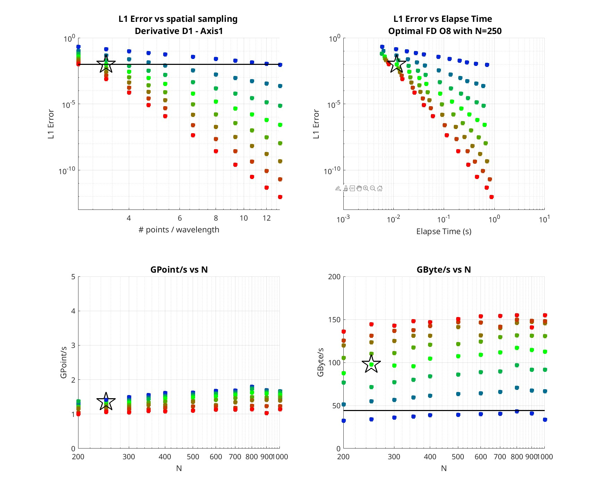
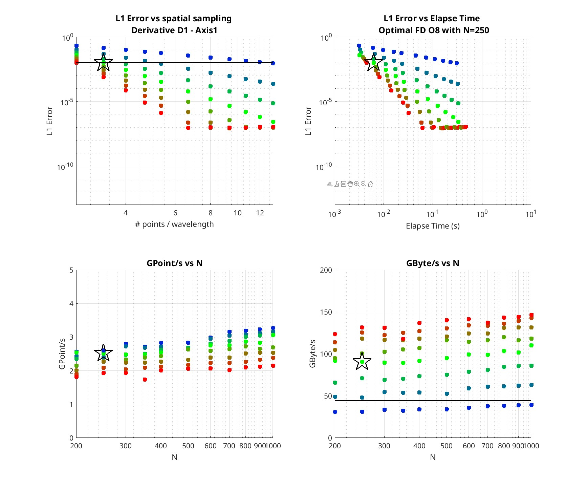

**Convergence analysis of D2 FD operator**

Description
* FD operator
    * 1st derivative in space
    * Reference solution: sine function       
    * Number of wavelengths in domain 75 x 75 x 75
* Model
    * Size 1km x 1km x 1km     
* FD parameters
    * Spatial order from 2 to 16
    * Grid size from 200x200x200 to 1000x1000x1000 grid points
    * Spacing from 3 to 12 points per wavelength

Launching the test
* `sh run_FD_D1_Convergence.sh`

Results visualization
* with Matlab script `plot_FD_D1_Convergence.m`

Example of results

With FP64

With FP32

