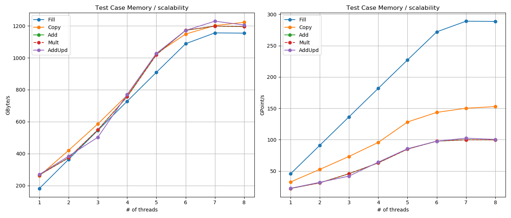

**Memory bandwidth and scalability**

Description
* Assess memory bandwidth of various simple array operations
    * Fill
    * Copy       
    * Add
    * Multiply
    * Add and multiply
* Grid size
    * 1000 x 1000 x 1000     
* Variable number of threads
    * From 1 threads to max. available

Launching the test
* `sh run_Memory_Bandwidth.sh`

Results visualization
* with Matlab script `plot_Memory_Bandwidth.m`
* or with Pyhton `plot_Memory_Bandwidth.py`

Example of results

