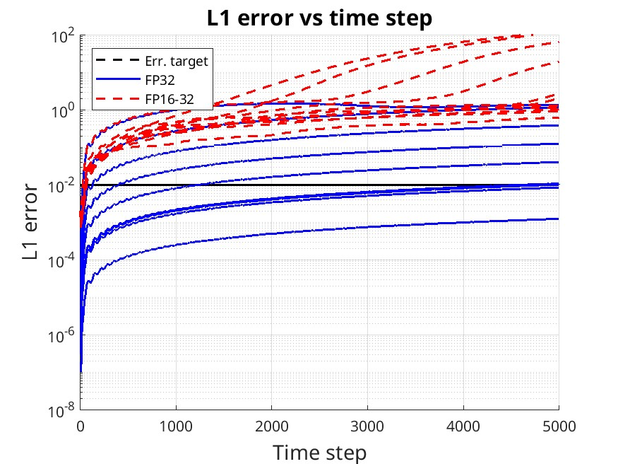

**Parametric analysis of acoustic propagator**

Description
* Propagator
    * 2nd order acoustic wave equation (pressure)  
    * Reference solution: eigen modes of the wave equation
    * Source excitation: entire wavefield (no source point)  
    * Number of wavelengths in wavefield 75 x 75 x 75
* Model
    * Size 1km x 1km x 1km
    * Homogeneous with Vp=1m/s  
* FD parameters
    * Spatial order 8
    * Time order 2
    * Nt=5000 (dt=0.1s)
    * Grid size from 200x200x200 to 1000x1000x1000 grid points
    * Spacing from 3 to 12 points per wavelength

Launching the test
* `sh runPropaParamAnalysis2.sh`

Results visualization
* with Matlab script `plotError.m`

Example of results

